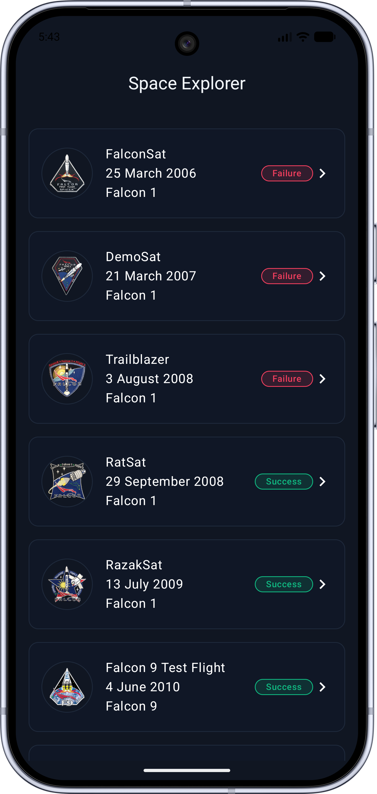
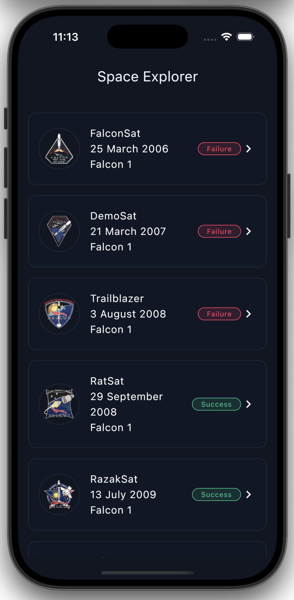
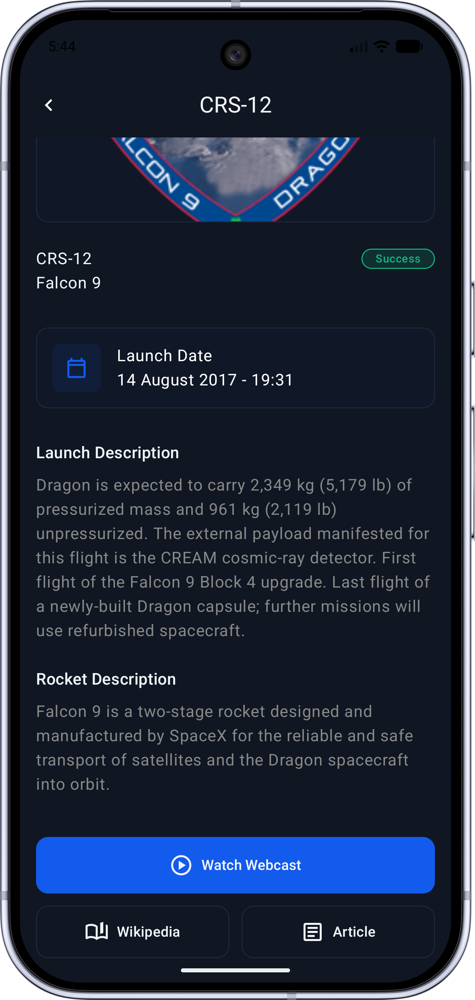
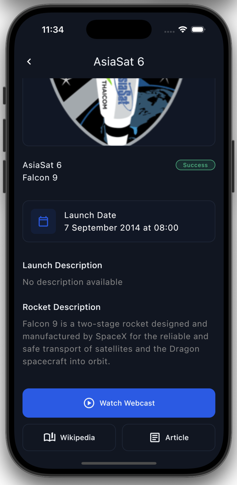

# SpaceExplorer

SpaceExplorer is a Kotlin Multiplatform (KMP) application designed to track space launches, built using modern Android and cross-platform development practices.

## Screenshots

<p align="center">
 
</p>
<p align="center">
 
</p>

## Features
- **Launch Tracking:** View upcoming and past space launches with detailed mission information.
- **Detailed Missions:** Dive into mission specifics, including rocket details, success status, and rich media links (articles, Wikipedia, webcasts).
- **Offline Support:** Robust local caching using Room database for seamless browsing without an active internet connection.
- **Smooth UI:** Modern, responsive UI built with Compose Multiplatform and enhanced with Lottie animations.
- **Platform-specific Abstractions:** Date/time parsing and external URL opening are implemented using Kotlin Multiplatform's expect/actual mechanism to ensure correct behavior on both Android and iOS.

## Architecture
The project follows **Clean Architecture** principles combined with the **MVVM (Model-View-ViewModel)** and **MVI-like State Management** patterns to ensure a highly maintainable, testable, and scalable codebase.

## Project Structure
```text
composeApp/
├── src/
│   ├── commonMain/         # Shared UI and business logic
│   │   ├── kotlin/
│   │   │   └── spaceexplorer/
│   │   │       ├── data/           # Data layer (Remote, Local, Repo Impl)
│   │   │       ├── di/             # Dependency Injection modules
│   │   │       ├── domain/         # Domain layer (Models, UseCases, Repo Interfaces)
│   │   │       ├── presentation/   # UI layer (Screens, ViewModels, Themes)
│   │   │       └── App.kt          # Main UI Entry point & Navigation
│   │   └── composeResources/   # Shared assets (images, fonts, lottie)
│   ├── androidMain/        # Android-specific implementations
│   └── iosMain/            # iOS-specific implementations
```

### Why Clean Architecture?

Although the application is relatively small (two main screens), the project was intentionally structured using Clean Architecture.

In a small, single-developer project, a simpler MVVM-based architecture could have been sufficient and faster to implement. However, this project was designed with scalability and maintainability in mind.

The benefits of this approach include:

- **Separation of concerns** between UI, business logic, and data sources
- **Improved testability** through isolated domain logic
- **Scalability** when the application grows in complexity
- **Team-friendly structure**, making it easier for multiple developers to work on different layers independently

This structure ensures that the project can evolve into a larger production application without requiring major architectural refactoring.

### Why Compose Multiplatform for UI?

The project uses **Compose Multiplatform** to share the UI layer across both Android and iOS platforms.
A design mockup generated by Google Stitch AI was used only as a visual reference: [View mockup](https://stitch.withgoogle.com/projects/5360931322197906251)

- **Maximum code sharing:** Both UI and business logic are shared between Android and iOS, significantly reducing duplicated code.
- **Faster development:** Maintaining a single UI codebase allows faster iteration and feature development.
- **Consistent UI/UX:** Both platforms render the same UI components and interaction patterns, ensuring visual and behavioral consistency.
- **Compose Multiplatform maturity:** Compose Multiplatform has reached a stable and production-ready level for many use cases, making it a viable option for real-world applications.

This approach is especially beneficial for **small teams or solo developers**, where maintaining two separate UI implementations could introduce unnecessary complexity.

However, if the project required **deep platform-specific UX patterns** or **native UI conventions**, implementing platform-specific UIs while sharing only the business logic would also be a valid architectural choice.


### Offline-First Data Strategy

The application follows an **offline-first pattern** to ensure a robust and seamless user experience, even when the network is unavailable.

**Key principles of this approach:**

- **Single Source of Truth:** The Room database acts as the authoritative source of data. The UI observes the database through `Flow`, ensuring that all state changes are consistent and predictable.
- **UI Observes DB, Not API:** The ViewModel exposes a `UiState` derived from database changes. Network calls only update the database, rather than being directly consumed by the UI.
- **Automatic and Manual Refresh:** Launch data is refreshed automatically on app startup, and users can also manually trigger a pull-to-refresh action. This ensures that the data remains up-to-date without breaking offline availability.
- **Graceful Offline Handling:** If the network is unavailable, the app continues to display cached data without errors, providing a smooth user experience.

**Data Flow Overview:**
```text
API
 ↓
DTO
 ↓
Mapper
 ↓
Entity
 ↓
Room Database
 ↓
Flow
 ↓
ViewModel
 ↓
UiState
 ↓
Compose UI
```

### UI State Management

The application follows a **Unidirectional Data Flow (UDF)** pattern:

- **UiState:** Represents the current state of the screen, including data, loading, and error states.
- **Events:** User-triggered actions, such as `LoadLaunches`, `RefreshLaunches`, or `OnLaunchClick`.
- **Effects:** One-time actions like navigation or showing snackbars, implemented using a `Channel` and collected as flows.

**Example: Home Screen State Management**

```kotlin
data class HomeUiState(
    val launches: UiState<List<Launch>> = UiState.Idle,
    val isRefreshing: Boolean = false
)

sealed class HomeEvent {
    object LoadLaunches : HomeEvent()
    object RefreshLaunches : HomeEvent()
    data class OnLaunchClick(val launch: Launch) : HomeEvent()
}

sealed class HomeEffect {
    data class NavigateToDetail(val launch: Launch) : HomeEffect()
}
```

```text
User Interaction
       ↓
     Event
       ↓
  ViewModel
       ↓
   UiState / Effect
       ↓
  Compose UI recomposition
```

### Layers
1.  **Domain Layer:**
    *   Contains pure Kotlin business logic.
    *   Defines **Models** (e.g., `Launch`) used across the application.
    *   Defines **Repository Interfaces** to decouple business logic from data implementations.
    *   Contains **Use Cases** (e.g., `ObserveLaunchesUseCase`, `RefreshLaunchesUseCase`) for specific business operations.
2.  **Data Layer:**
    *   Implements the Repository interfaces.
    *   Manages **Remote Data Source** (Ktor) for fetching API data.
    *   Manages **Local Data Source** (Room) for persistence and caching.
    *   Includes **Mappers** to transform DTOs and Entities into Domain models.
3.  **Presentation Layer:**
    *   Shared UI using **Compose Multiplatform**.
    *   **ViewModels** (KMP) managing **UiState** and handling user **Events**.
    *   **Unidirectional Data Flow (UDF):**
        *   `UiState`: Represents the current state of the screen.
        *   `Events`: Actions triggered by the user (e.g., `RefreshLaunches`).
        *   `Effects`: One-time side effects like navigation.

## Tech Stack
- **Multiplatform:** [Kotlin Multiplatform (KMP)](https://kotlinlang.org/docs/multiplatform.html) for sharing logic and UI across Android and iOS.
- **UI Framework:** [Compose Multiplatform](https://www.jetbrains.com/lp/compose-multiplatform/) for a unified UI codebase.
- **Dependency Injection:** [Koin](https://insert-koin.io/) for lightweight, multiplatform DI.
- **Networking:** [Ktor](https://ktor.io/) for asynchronous client-server communication.
- **Local Database:** [Room](https://developer.android.com/kotlin/multiplatform/room) (KMP version) for robust SQLite-based persistence.
- **Concurrency:** [Kotlin Coroutines](https://kotlinlang.org/docs/coroutines-overview.html) & [Flow](https://kotlinlang.org/docs/flow.html).
- **Image Loading:** [Coil3](https://coil-kt.github.io/coil/) for optimized cross-platform image loading.
- **Serialization:** [Kotlinx Serialization](https://github.com/Kotlin/kotlinx.serialization).
- **Navigation:** [Jetpack Compose Navigation](https://developer.android.com/guide/navigation/design/type-safety) for type-safe routing.
- **Animations:** [Compottie](https://github.com/alexzhirkevich/compottie) for Lottie animation support in KMP.


